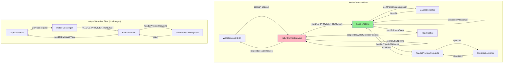
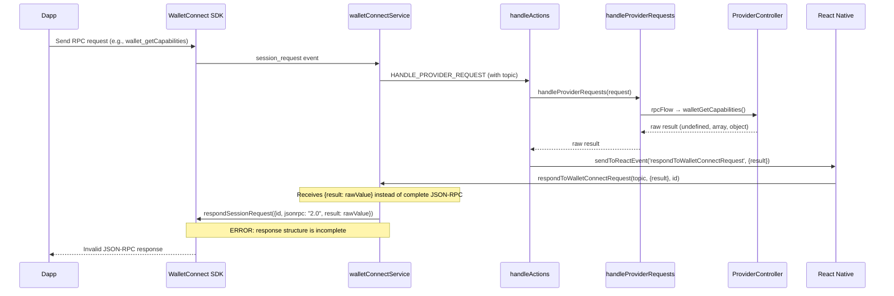
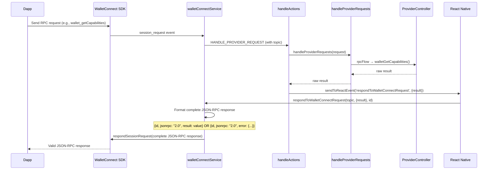

# Design Document: WalletConnect Dapp Communication Adapter

## Overview

The current implementation correctly reuses the existing communication logic (`handleProviderRequests`, `rpcFlow`, `ProviderController`) for WalletConnect connections, but has a response formatting issue in the WalletConnect service/context layer. The existing communication logic returns raw result values (e.g., `undefined`, arrays, objects), which is correct for its design. However, the WalletConnect SDK requires complete JSON-RPC response objects with `result` or `error` fields wrapped in a proper structure.

**The Real Problem**: The WalletConnect service layer (`respondToWalletConnectRequest`) receives raw results from the existing communication logic but doesn't properly format them into complete JSON-RPC responses before sending to the WalletConnect SDK, causing "Missing or invalid respond() response" errors.

**The Solution**: Keep the existing communication logic (`handleProviderRequests`, `rpcFlow`, `ProviderController`) completely unchanged and in use for WalletConnect. Fix the response formatting in the WalletConnect service/context layer to properly wrap raw results into JSON-RPC response structures before sending to the WalletConnect SDK.

## Architecture



## Sequence Diagrams

### Current Flow (Problematic)



### Proposed Flow (Fixed)



## Components and Interfaces

### Component 1: Enhanced respondToWalletConnectRequest

**Purpose**: Update the WalletConnect service function to properly format raw results into complete JSON-RPC responses

**Interface**:
```typescript
interface RespondToWalletConnectRequest {
  (topic: string, response: RawResponse, id: number): Promise<void>
}

interface RawResponse {
  result?: any
  error?: any
}

interface JsonRpcResponse {
  id: number
  jsonrpc: '2.0'
  result?: any
  error?: {
    code: number
    message: string
    data?: any
  }
}
```

**Responsibilities**:
- Receive raw response from handleActions (via React Native bridge)
- Detect whether response contains result or error
- Format raw result/error into complete JSON-RPC response structure
- Handle undefined results (convert to null)
- Handle error serialization
- Send properly formatted JSON-RPC response to WalletConnect SDK

### Component 2: Enhanced handleActions (WalletConnect Response Path)

**Purpose**: Update the existing HANDLE_PROVIDER_REQUEST handler to properly structure responses for WalletConnect

**Interface**:
```typescript
// No interface changes - internal logic update only
// Existing HANDLE_PROVIDER_REQUEST action continues to work
```

**Responsibilities**:
- Continue using existing communication logic (handleProviderRequests, rpcFlow, ProviderController)
- Detect WalletConnect requests via topic parameter
- Send raw results to React Native via sendToReactEvent
- Maintain existing webview response path unchanged
- Ensure WalletConnect requests are not blocked by any checks

### Component 3: Response Formatter Utility

**Purpose**: Utility functions to format raw results into JSON-RPC responses

**Interface**:
```typescript
interface ResponseFormatter {
  formatSuccessResponse(id: number, result: any): JsonRpcResponse
  formatErrorResponse(id: number, error: any): JsonRpcResponse
}
```

**Responsibilities**:
- Format successful results into JSON-RPC success responses
- Format errors into JSON-RPC error responses
- Ensure all responses have required fields (id, jsonrpc, result OR error)
- Handle edge cases (undefined results, null results, etc.)
- Convert undefined to null for result field

## Data Models

### Model 1: RawResponse (from handleActions)

```typescript
interface RawResponse {
  result?: any           // Raw result from handleProviderRequests
  error?: any            // Raw error from handleProviderRequests
}
```

**Validation Rules**:
- Must have either result or error, not both
- result can be any type (undefined, null, primitive, object, array)
- error can be Error object or serialized error object

### Model 2: JsonRpcResponse (to WalletConnect SDK)

```typescript
interface JsonRpcResponse {
  id: number
  jsonrpc: '2.0'
  result?: any
  error?: JsonRpcError
}

interface JsonRpcError {
  code: number
  message: string
  data?: any
}
```

**Validation Rules**:
- id must match request ID
- jsonrpc must be exactly '2.0'
- Must have either result OR error, never both
- If error present, must have code and message
- error.code must be valid JSON-RPC error code
- result should never be undefined (convert to null)

## Algorithmic Pseudocode

### Response Formatting in respondToWalletConnectRequest

```pascal
ALGORITHM respondToWalletConnectRequest(topic, rawResponse, id)
INPUT: topic of type string, rawResponse of type RawResponse, id of type number
OUTPUT: None (sends response to WalletConnect SDK)

BEGIN
  // Step 1: Check if walletKit is initialized
  IF walletKit IS NULL THEN
    RETURN
  END IF

  // Step 2: Determine if response is error or success
  IF rawResponse.error IS NOT undefined THEN
    // Step 3a: Format error response
    errorObj ← formatErrorObject(rawResponse.error)
    jsonRpcResponse ← {
      id: id,
      jsonrpc: '2.0',
      error: errorObj
    }
  ELSE
    // Step 3b: Format success response
    result ← rawResponse.result
    IF result IS undefined THEN
      result ← null
    END IF
    jsonRpcResponse ← {
      id: id,
      jsonrpc: '2.0',
      result: result
    }
  END IF

  // Step 4: Send formatted response to WalletConnect SDK
  AWAIT walletKit.respondSessionRequest({
    topic: topic,
    response: jsonRpcResponse
  })
END
```

**Preconditions:**
- walletKit is initialized (or function returns early)
- topic is a valid WalletConnect session topic
- id is a positive integer matching the request ID
- rawResponse contains either result or error field

**Postconditions:**
- Complete JSON-RPC response is sent to WalletConnect SDK
- Response contains id, jsonrpc, and either result or error
- undefined results are converted to null
- Errors are properly formatted with code and message

**Loop Invariants:** N/A (no loops in algorithm)

### Error Object Formatting

```pascal
ALGORITHM formatErrorObject(error)
INPUT: error of type any
OUTPUT: errorObj of type JsonRpcError

BEGIN
  // Step 1: Try to serialize error if it has serialize method
  IF error HAS METHOD serialize THEN
    errorObj ← error.serialize()
  ELSE IF error IS object AND error HAS PROPERTY code AND error HAS PROPERTY message THEN
    // Step 2: Error is already formatted
    errorObj ← error
  ELSE
    // Step 3: Create default error object
    errorObj ← {
      code: error.code OR 5000,
      message: error.message OR error.toString() OR 'Unknown error',
      data: error.data OR undefined
    }
  END IF

  RETURN errorObj
END
```

**Preconditions:**
- error is defined (not null/undefined)

**Postconditions:**
- Returns object with code and message fields
- code is a valid error code number
- message is a non-empty string
- data is optional

## Key Functions with Formal Specifications

### Function 1: respondToWalletConnectRequest()

```typescript
async function respondToWalletConnectRequest(
  topic: string,
  rawResponse: RawResponse,
  id: number
): Promise<void>
```

**Preconditions:**
- `walletKit` is initialized (or function returns early)
- `topic` is a valid non-empty WalletConnect session topic string
- `id` is a positive integer matching the original request ID
- `rawResponse` contains either `result` or `error` field (not both)

**Postconditions:**
- Complete JSON-RPC response is sent to WalletConnect SDK via `respondSessionRequest`
- Response contains `id`, `jsonrpc: '2.0'`, and either `result` or `error` field
- If `rawResponse.result` is undefined, it is converted to null in the JSON-RPC response
- If `rawResponse.error` exists, it is formatted with `code` and `message` fields
- No side effects on other sessions or connections

**Loop Invariants:** N/A

### Function 2: formatErrorObject()

```typescript
function formatErrorObject(error: any): JsonRpcError
```

**Preconditions:**
- `error` is defined (not null/undefined)

**Postconditions:**
- Returns object with `code` (number) and `message` (string) fields
- If error has `serialize()` method, uses that for serialization
- If error lacks `code`, defaults to 5000
- If error lacks `message`, uses error.toString() or 'Unknown error'
- `data` field is optional and included if present in original error
- No mutations to input parameter

**Loop Invariants:** N/A

### Function 3: handleActions (HANDLE_PROVIDER_REQUEST for WalletConnect)

```typescript
// Existing function - no signature changes
// Internal logic update only
```

**Preconditions:**
- Action type is 'HANDLE_PROVIDER_REQUEST'
- `params.topic` contains WalletConnect topic identifier (e.g., 'wc_session_request_...')
- `params.request` contains valid provider request with method and params
- Controllers are initialized

**Postconditions:**
- Dapp session is created or retrieved using existing logic
- Session messenger is attached using existing logic
- `handleProviderRequests` is called with proper context (UNCHANGED)
- Raw result/error is sent to React Native via `sendToReactEvent`
- Response structure includes topic, result/error, and request ID
- Existing webview flow remains unchanged

**Loop Invariants:** N/A

## Example Usage

### Example 1: Successful wallet_getCapabilities Request

```typescript
// WalletConnect SDK receives request from dapp
const requestEvent = {
  topic: 'abc123...',
  id: 1778243695772291,
  params: {
    request: {
      method: 'wallet_getCapabilities',
      params: ['0x1234...']
    }
  }
}

// walletConnectService dispatches HANDLE_PROVIDER_REQUEST
// handleActions processes via existing communication logic
// Result: sendToReactEvent called with raw result:
{
  type: 'action.respondToWalletConnectRequest',
  payload: {
    topic: 'abc123...',
    response: {
      result: {
        '0x1': {
          atomicBatch: { supported: true },
          auxiliaryFunds: { supported: true },
          paymasterService: { supported: true }
        }
      }
    },
    id: 1778243695772291
  }
}

// respondToWalletConnectRequest formats and sends to WalletConnect SDK:
await walletKit.respondSessionRequest({
  topic: 'abc123...',
  response: {
    id: 1778243695772291,
    jsonrpc: '2.0',
    result: {
      '0x1': {
        atomicBatch: { supported: true },
        auxiliaryFunds: { supported: true },
        paymasterService: { supported: true }
      }
    }
  }
})
```

### Example 2: Error Handling (Unauthorized)

```typescript
// Request from unauthorized dapp
const requestEvent = {
  topic: 'xyz789...',
  id: 1778243695772292,
  params: {
    request: {
      method: 'eth_accounts',
      params: []
    }
  }
}

// handleActions catches error from handleProviderRequests
// Result: sendToReactEvent called with error:
{
  type: 'action.respondToWalletConnectRequest',
  payload: {
    topic: 'xyz789...',
    response: {
      error: {
        code: 4100,
        message: 'The requested account and/or method has not been authorized by the user.'
      }
    },
    id: 1778243695772292
  }
}

// respondToWalletConnectRequest formats and sends to WalletConnect SDK:
await walletKit.respondSessionRequest({
  topic: 'xyz789...',
  response: {
    id: 1778243695772292,
    jsonrpc: '2.0',
    error: {
      code: 4100,
      message: 'The requested account and/or method has not been authorized by the user.'
    }
  }
})
```

### Example 3: Undefined Result Handling

```typescript
// Request that returns undefined (e.g., some methods)
const requestEvent = {
  topic: 'def456...',
  id: 1778243695772293,
  params: {
    request: {
      method: 'wallet_switchEthereumChain',
      params: [{ chainId: '0x1' }]
    }
  }
}

// handleProviderRequests returns undefined
// Result: sendToReactEvent called with:
{
  type: 'action.respondToWalletConnectRequest',
  payload: {
    topic: 'def456...',
    response: {
      result: undefined
    },
    id: 1778243695772293
  }
}

// respondToWalletConnectRequest converts undefined to null:
await walletKit.respondSessionRequest({
  topic: 'def456...',
  response: {
    id: 1778243695772293,
    jsonrpc: '2.0',
    result: null
  }
})
```

## Correctness Properties

*A property is a characteristic or behavior that should hold true across all valid executions of a system—essentially, a formal statement about what the system should do. Properties serve as the bridge between human-readable specifications and machine-verifiable correctness guarantees.*

### Property 1: JSON-RPC Response Structure Completeness

*For any* WalletConnect request processed by respondToWalletConnectRequest, the resulting JSON-RPC response sent to the WalletConnect SDK SHALL have exactly one of result or error fields (never both, never neither), SHALL have jsonrpc set to '2.0', and SHALL have an id field matching the request ID.

**Validates: Requirements 2.1, 2.2, 2.4, 2.5, 6.2, 6.3, 6.4, 6.5**

### Property 2: Undefined to Null Conversion

*For any* raw response with result field set to undefined, respondToWalletConnectRequest SHALL convert the undefined value to null in the JSON-RPC response result field before sending to WalletConnect SDK.

**Validates: Requirement 2.3**

### Property 3: Existing Communication Logic Preservation

*For any* WalletConnect request, the System SHALL use the existing handleProviderRequests, rpcFlow, and ProviderController logic without modification, ensuring WalletConnect requests are processed through the same code path as webview requests.

**Validates: Requirements 7.3, 7.4**

### Property 4: Response Formatting Layer Isolation

*For any* raw result or error returned by handleProviderRequests, the formatting into JSON-RPC structure SHALL occur only in the WalletConnect service layer (respondToWalletConnectRequest), not in handleActions or handleProviderRequests.

**Validates: Requirements 1.5, 2.1**

### Property 5: Session Creation and Reuse

*For any* sequence of WalletConnect requests with the same Session_Topic, the System SHALL reuse the existing Dapp_Session instead of creating new ones, and *for any* requests with different Session_Topics, the System SHALL create separate Dapp_Sessions.

**Validates: Requirements 1.2, 4.4, 10.1**

### Property 6: Messenger Attachment Consistency

*For any* Dapp_Session created or retrieved for a WalletConnect request, the System SHALL attach a WC_Bridge_Messenger with name 'wcBridgeMessenger' that includes the Session_Topic and chain ID.

**Validates: Requirements 1.3, 8.1, 8.2, 8.4**

### Property 7: Provider Controller Invocation

*For any* valid WalletConnect request that passes validation, handleActions SHALL invoke handleProviderRequests with the correct request details (method, params, origin, and session), using the existing communication logic.

**Validates: Requirement 1.4**

### Property 8: Error Handling Without Crashes

*For any* error thrown by handleProviderRequests, handleActions SHALL catch it, prevent application crashes, and send the raw error to React Native via sendToReactEvent.

**Validates: Requirement 3.1**

### Property 9: Conditional Error Serialization

*For any* error object with a serialize() method, handleActions SHALL invoke that method for serialization, and *for any* error object without a serialize() method, respondToWalletConnectRequest SHALL create a standard error object with code, message, and optional data fields.

**Validates: Requirements 3.2, 3.3**

### Property 10: Error Field Defaults

*For any* error object lacking a code field, respondToWalletConnectRequest SHALL use 5000 as the default error code, and *for any* error object lacking a message field, SHALL use error.toString() or 'Unknown error' as the default message.

**Validates: Requirements 3.4, 3.5**

### Property 11: Session Topic Identification

*For any* WalletConnect request, handleActions SHALL use the topic parameter to identify WalletConnect requests and route responses appropriately.

**Validates: Requirement 4.1**

### Property 12: Origin Extraction from Metadata

*For any* Dapp_Session creation, the System SHALL use the proposer URL from the WalletConnect session metadata as the origin.

**Validates: Requirement 4.2**

### Property 13: Session Isolation

*For any* two WalletConnect sessions with different Session_Topics, attaching a WC_Bridge_Messenger to one session SHALL NOT affect the other session's messenger or state.

**Validates: Requirement 4.5**

### Property 14: Action Dispatching Correctness

*For any* WalletConnect session_request event received by walletConnectService, the System SHALL dispatch a HANDLE_PROVIDER_REQUEST action (existing action type) containing the request with topic parameter for WalletConnect identification.

**Validates: Requirements 5.1, 5.2, 7.1, 7.5**

### Property 15: Response Event Routing

*For any* completed WalletConnect request processing, handleActions SHALL send the raw response via sendToReactEvent with type 'action.respondToWalletConnectRequest' and payload containing Session_Topic, raw result/error, and Request_ID.

**Validates: Requirements 5.3, 5.4**

### Property 16: Response Guarantee

*For any* WalletConnect request processed (whether valid or invalid, successful or failed), the System SHALL always send a response via sendToReactEvent.

**Validates: Requirement 6.1**

### Property 17: Webview Flow Preservation

*For any* in-app webview provider request (identified by absence of WalletConnect topic), handleActions SHALL send responses through the webview message bridge using sendToDappWebView, maintaining the existing flow unchanged.

**Validates: Requirements 7.1, 7.2, 7.4**

### Property 18: Messenger Parameter Correctness

*For any* call to setSessionMessenger for a WalletConnect session, the System SHALL pass the session ID, the WC_Bridge_Messenger, and the available flag set to false.

**Validates: Requirement 8.3**

### Property 19: No Blocking Checks

*For any* WalletConnect request processed through handleProviderRequests, the System SHALL NOT block the request based on webview-specific checks, ensuring WalletConnect requests are treated equivalently to webview requests.

**Validates: Requirement 7.3**

## Error Handling

### Error Scenario 1: Provider Request Failure

**Condition**: handleProviderRequests throws an error (e.g., unauthorized, invalid params)
**Response**: handleActions catches error, serializes it if possible, sends raw error to React Native
**Recovery**: respondToWalletConnectRequest formats error as JSON-RPC error response, sends to WalletConnect SDK

### Error Scenario 2: Session Creation Failure

**Condition**: getOrCreateDappSession fails (e.g., invalid URL, controller error)
**Response**: handleActions catches error, sends error to React Native
**Recovery**: respondToWalletConnectRequest formats as JSON-RPC error with code 5000, sends to WalletConnect

### Error Scenario 3: Undefined Result

**Condition**: handleProviderRequests returns undefined (e.g., for some methods like wallet_switchEthereumChain)
**Response**: handleActions sends raw undefined result to React Native
**Recovery**: respondToWalletConnectRequest converts undefined to null, sends valid JSON-RPC response

### Error Scenario 4: Messenger Setup Failure

**Condition**: setSessionMessenger fails or messenger not available
**Response**: Log error, continue with request processing
**Recovery**: Request may succeed but broadcast events may not work

### Error Scenario 5: WalletKit Not Initialized

**Condition**: respondToWalletConnectRequest called before walletKit is initialized
**Response**: Function returns early without sending response
**Recovery**: Request times out on dapp side, user may need to retry connection

## Testing Strategy

### Unit Testing Approach

**Test Coverage Goals**: 90%+ coverage for response formatting logic in respondToWalletConnectRequest

**Key Test Cases**:
1. **respondToWalletConnectRequest**:
   - Formats success responses with valid result
   - Converts undefined result to null
   - Formats error responses with code and message
   - Handles errors without serialize() method
   - Sets default error code if missing
   - Returns early if walletKit not initialized
   - Preserves arrays, objects, primitives correctly

2. **formatErrorObject** (utility):
   - Formats errors with serialize() method
   - Formats plain error objects
   - Sets default error code if missing
   - Includes error message and data

3. **handleActions (WalletConnect path)**:
   - Detects WalletConnect requests via topic parameter
   - Creates dapp session for new connections
   - Reuses existing sessions
   - Sets up wcBridgeMessenger correctly
   - Calls handleProviderRequests with correct params (UNCHANGED)
   - Sends raw results to React Native
   - Maintains webview response path unchanged

### Integration Testing Approach

**Test Scenarios**:
1. **End-to-End WalletConnect Flow**:
   - Simulate WalletConnect session_request event
   - Verify dapp session creation
   - Verify messenger setup
   - Verify provider request processing through existing logic
   - Verify raw response sent to React Native
   - Verify JSON-RPC formatting in respondToWalletConnectRequest
   - Verify response sent to WalletConnect SDK

2. **Multiple Concurrent Requests**:
   - Send multiple requests from same session
   - Send requests from different sessions
   - Verify no interference between sessions
   - Verify correct responses for each request

3. **Error Scenarios**:
   - Test unauthorized requests
   - Test invalid parameters
   - Test network errors
   - Verify proper error formatting at service layer

4. **Webview Flow Preservation**:
   - Test in-app webview requests
   - Verify responses go through webview bridge
   - Verify no interference with WalletConnect flow

### Property-Based Testing Approach

**Property Test Library**: fast-check (for TypeScript/JavaScript)

**Properties to Test**:
1. **Response Completeness**: Every request produces response with result XOR error
2. **JSON-RPC Compliance**: All responses have id, jsonrpc, and result/error
3. **ID Preservation**: Response ID always matches request ID
4. **Error Code Validity**: All error codes are valid JSON-RPC codes
5. **No Undefined Results**: Result field is never undefined (null is ok)
6. **Communication Logic Preservation**: handleProviderRequests behavior unchanged

## Performance Considerations

- **Session Caching**: Reuse existing dapp sessions instead of creating new ones for each request (existing behavior preserved)
- **Messenger Reuse**: wcBridgeMessenger is lightweight and created per session, minimal overhead (existing behavior preserved)
- **Response Formatting**: Simple object creation in respondToWalletConnectRequest, negligible performance impact
- **Error Serialization**: Only serialize errors when needed, minimal overhead
- **Async Processing**: All operations are async, no blocking of main thread (existing behavior preserved)
- **No Additional Layers**: Response formatting happens only at service layer, no intermediate handlers

## Security Considerations

- **Origin Validation**: Verify proposer URL from WalletConnect session metadata (existing behavior preserved)
- **Session Isolation**: Each WalletConnect connection gets separate dapp session (existing behavior preserved)
- **Permission Checks**: handleProviderRequests enforces existing permission checks (UNCHANGED)
- **Error Information Leakage**: Sanitize error messages to avoid exposing sensitive data (existing behavior)
- **Request ID Validation**: Ensure request IDs are positive integers to prevent injection (existing behavior)
- **No New Attack Surface**: Changes are limited to response formatting layer, no new security risks introduced

## Dependencies

- **@walletconnect/react-native-compat**: WalletConnect compatibility layer
- **@reown/walletkit**: WalletConnect WalletKit SDK
- **@walletconnect/core**: WalletConnect Core SDK
- **@walletconnect/utils**: WalletConnect utility functions
- **@ambire-common/controllers/main/main**: MainController for dapp management (UNCHANGED)
- **@common/modules/provider/handleProviderRequests**: Common provider request handler (UNCHANGED)
- **@common/modules/provider/rpcFlow**: RPC flow handler (UNCHANGED)
- **@common/modules/provider/ProviderController**: Provider controller (UNCHANGED)
- **eth-rpc-errors**: Standard Ethereum RPC error formatting (existing dependency)

## Implementation Strategy

### Phase 1: Update respondToWalletConnectRequest (Primary Fix)
1. Modify `respondToWalletConnectRequest` in `walletConnectService.ts`
2. Add response formatting logic to handle raw results/errors
3. Convert undefined results to null
4. Format errors with code and message fields
5. Construct complete JSON-RPC response structure
6. Test with real WalletConnect connections

### Phase 2: Investigate and Remove Blocking Checks (If Needed)
1. Review `handleProviderRequests`, `rpcFlow`, and `ProviderController` for any webview-specific checks
2. If found, ensure WalletConnect requests are not blocked
3. Verify WalletConnect requests flow through existing logic without issues
4. Test edge cases (unauthorized, invalid params, etc.)

### Phase 3: Verify handleActions Response Path
1. Confirm handleActions correctly detects WalletConnect requests via topic parameter
2. Verify raw results/errors are sent to React Native correctly
3. Ensure webview response path remains unchanged
4. Test both WalletConnect and webview flows

### Phase 4: Testing and Validation
1. Unit test respondToWalletConnectRequest formatting logic
2. Integration test end-to-end WalletConnect flow
3. Test error scenarios (unauthorized, invalid params, undefined results)
4. Verify no regression in webview flow
5. Test with multiple concurrent requests

## Implementation Notes

- **Primary Change**: Response formatting in `respondToWalletConnectRequest` function
- **Secondary Investigation**: Check for any blocking logic in existing communication handlers
- **No New Handlers**: Do NOT create new WalletConnect-specific handlers or wrappers
- **Preserve Existing Logic**: Keep `handleProviderRequests`, `rpcFlow`, `ProviderController` completely unchanged
- **Minimal Changes**: Focus changes on WalletConnect service/context layer only
- **Existing Flow**: WalletConnect requests continue to use HANDLE_PROVIDER_REQUEST action
- **Session Management**: Existing session creation and messenger setup logic remains unchanged
