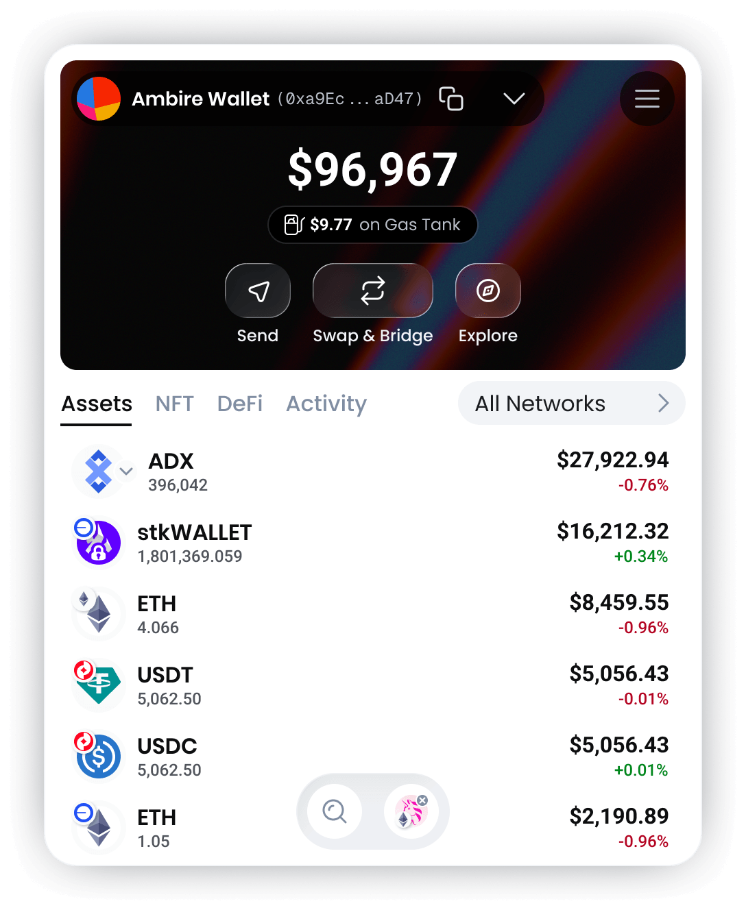

# Ambire Wallet

<div align="center">
  <a href="https://chromewebstore.google.com/detail/ambire-wallet/ehgjhhccekdedpbkifaojjaefeohnoea" target="_blank">
    <picture>
      <source media="(prefers-color-scheme: dark)" srcset="./mockups/mockup-dashboard-dark-v6.png">
      <source media="(prefers-color-scheme: light)" srcset="./mockups/mockup-dashboard-light-v6.png">
      
    </picture>
  </a>

  <p>
    Your Web3 wallet that just works. EIP-7702 ready.<br>
    <em>A self-custodial browser wallet extension built for Ethereum and EVM networks.</em><br />
    <a href="https://www.ambire.com/get-extension" target="_blank">
      <strong>Download Ambire extension 🔥</strong>
    </a>
    <br />
    <em>(Chrome, Firefox, Brave, Opera, Edge, Arc)</em>
    <br /><br />
    👥 Join the community:
    <a href="https://discord.com/invite/Ambire" target="_blank">Discord</a> |
    <a href="https://t.me/AmbireOfficial" target="_blank">Telegram</a>
    <br />
    🐞
    <a href="https://github.com/AmbireTech/extension/issues">Report a Bug</a> ·
    <a href="https://help.ambire.com/en" target="_blank">Get help</a>
  </p>
</div>

## Environment Setup

Built in a hybrid approach (with React Native and React Native Web) so that in a single codebase we can support building cross-browser extensions, mobile apps and web apps.

This project is built with Expo's bare workflow, allowing us to extend the default Vanilla React Native with additional expo modules in the form of installable expo libraries.

More about the environment setup and prerequisites [here](https://reactnative.dev/docs/environment-setup).

Toolchain versions are pinned in the repo, so use a version manager that reads them (nvm, rbenv, jenv, etc.)

| Tool      | File             | Target   |
| --------- | ---------------- | -------- |
| Node      | `.nvmrc`         | All apps |
| Yarn      | `package.json`   | All apps |
| Ruby      | `.ruby-version`  | iOS      |
| Xcode     | `.xcode-version` | iOS      |
| CocoaPods | `Gemfile`        | iOS      |
| JDK       | `.java-version`  | Android  |

Yarn and CocoaPods are not picked up by a version manager: Yarn is pinned via `packageManager`/`engines` in `package.json`, CocoaPods via the `Gemfile` (run it through `bundle exec`, see "Mobile Apps").

## Install

Install all dependencies:

```bash
yarn setup
```

Install the [ambire-common](https://github.com/AmbireTech/ambire-common) submodule, a common ground for the Ambire apps, run:

```bash
git submodule init
git submodule update
```

## Environment Variables

Create ".env" file in the root directory and fill in all variables, see ".env-sample" for a reference.

## Editor Config

Make sure your code editor has plugins that support the following configuration files: `.editorconfig`, `.prettierrc`, `tsconfig.json`, `eslintrc.js`, [`import-sorter.json`](https://github.com/SoominHan/import-sorter).

## Browser Extensions

### Development-optimized Builds

- Start the browser extension for webkit browsers (tested mostly on Chrome and Brave):

  ```bash
  yarn web:webkit
  ```

  Then follow the instructions to load an unpacked extension [here](https://developer.chrome.com/docs/extensions/get-started/tutorial/hello-world#load-unpacked).

- Start the browser extension for gecko browsers (tested mostly on Firefox):

  ```bash
  yarn web:gecko
  ```

  Then follow the instructions to temporarily install an extension in Firefox [here](https://extensionworkshop.com/documentation/develop/temporary-installation-in-firefox/).

- Start the browser extension for the Safari browser:

  ```bash
  yarn web:safari
  ```

  Two new folders will be created:

  - build/safari-dev (dev build folder)
  - safari-extension/wallet-dev (Xcode project)

  then in the Safari browser:

  - Developer -> Developer settings...
  - Check the “Allow unsigned extensions” option. (Note: This setting may not persist after Safari is restarted.)​
  - Then the extension should be automatically added and pinned in the browser.

  NOTE: You can manage the available extensions from: Safari -> Settings... -> Extensions

  NOTE: The development script for Safari relies on the fswatch tool to automatically reload the Safari build when the development server is reloaded. If fswatch is not already installed on your system, you can install it using Homebrew with the following command:

  ```bash
  brew install fswatch
  ```

### Production-optimized Builds

- For webkit browsers:

  ```bash
  yarn build:web:webkit
  ```

  And find the resulting build in the "build/webkit-prod" folder.

- For gecko browsers:

  ```bash
  yarn build:web:gecko
  ```

  And find the resulting build in the "build/gecko-prod" folder.

- For the Safari browser:

  ```bash
  yarn build:web:safari
  ```

  Two new folders will be created:

  - "build/safari-prod" (production build folder)
  - "safari-extension/wallet" (the Xcode project)

  Then, in xCode manually do (TODO: automate these steps, it turned out to be a huge challenge):

  - Delete "walletTests" and "walletUITests" targets.
  - For both targets (macOS and extension): Signing & Capabilities: Team: "Ambire Tech Ltd", Signing Certificate: Development
  - For both targets (macOS and extension): General - Identity - Version: X.X (should match the version in the app.json file, example: `4.36`) and Build: X (integer, bump up on every next build submitted to the App Store Connect, example: `3`)
  - For the macOS target: General - App Category: "Utilities"
  - For the extension target: General - Identity - Bundle Identifier: `com.ambire.app.wallet.extension`

### LavaMoat Policy Generation

The extension uses [LavaMoat](https://github.com/LavaMoat/LavaMoat) with SES (Secure EcmaScript) to harden the background service worker. LavaMoat uses a policy file (`lavamoat/webpack/policy.json`) to control which packages can import what and access which globals.

#### When to Regenerate Policy

Regenerate the policy when:

- Adding/removing dependencies
- Updating dependencies that change their import patterns
- Runtime errors: "Policy does not allow importing X from Y"
- Runtime errors: "Policy does not allow accessing global X"

Do NOT regenerate for:

- Every build (policy is stable and should be version-controlled)
- Code changes that don't affect dependencies
- UI changes (UI chunks are unlocked and don't use policy)

#### Policy Generation Workflow

1. **Generate policy:**

   ```bash
   yarn build:extensions:generate-policy
   ```

2. **Review generated policy:**

   - Check `lavamoat/webpack/policy.json` for any unexpected entries
   - Review package dependencies and global access patterns

3. **Update policy overrides:**

   - Manually edit `lavamoat/webpack/policy-override.json` for custom overrides
   - Common overrides: primordial mutations, font packages, reflect-metadata globals

4. **Commit policy files:**

   - Both `policy.json` and `policy-override.json` should be version-controlled
   - This ensures consistent builds across environments

**Note:** The same policy works for both gecko and webkit builds since they share the same dependencies and only differ in entry points (which are mostly unlocked).

### Extract Source Maps

The production-optimized builds come with source maps files included. When preparing a production build for a browser store release, run the following commands to extract the source maps in separate directories:

- For the webkit build:

  ```bash
  yarn export:web:webkit:sourcemaps
  ```

  As a result, build/webkit-prod will no longer include the source map files (as before). Instead, a new folder, build/webkit-prod-source-maps, will be created to hold only the source maps. This folder should also be included in the GitHub release tag we create.

- For the gecko build:

  ```bash
  yarn export:web:gecko:sourcemaps
  ```

  Same as for the webkit build, but for the gecko build.

- For the Safari build: not implemented yet.

For more details, including how to trace /deminify a production reported error, see [#3191](https://github.com/AmbireTech/ambire-app/pull/3191).

### Store-prepared Builds

Automates the steps before every extension extension store release that could be otherwise done manually:

- Makes webkit and gecko extension production builds
- Exports source maps to "clean" the builds (and to prepare for upload those source maps in the GitHub release)
- Zips the "clean" builds (stores accept zips only) and the source maps

```bash
yarn build:extensions
```

And find the resulting zips in the "build" folder as `ambire-extension-<VERSION>-<TYPE>.zip`

## Mobile Apps

The mobile apps share the same codebase, but the business logic (the `background`) runs inside a WebView worker (`src/mobile/modules/webview/services/`) instead of a service worker. That's why every mobile build needs the webview bundle built (or the webview dev server running).

### Install

- For iOS: Make sure you have Xcode + CocoaPods via bundler (see the "Environment Setup" section), then install the pods:

  ```bash
  cd ios && bundle install && bundle exec pod install
  ```

- For Android: Make sure you have Android Studio with the Android SDK and the NDK required by React Native (see "Environment Setup" section).

### Development-optimized Builds

Run the webview dev server in one terminal (the app shows an explicit error screen if it isn't running):

```bash
yarn dev:webview
```

Then, in another terminal, compile a new native build and run it on a simulator/emulator or a connected device:

```bash
yarn ios
# or
yarn android
```

These recompile the native app every time, which is slow. If the app is already installed, only the Metro bundler is needed - start it with a cleared cache and launch the app from the device:

```bash
yarn start:clean
```

A new native build is only needed after changing native code or native dependencies.

#### Webview dev server

It listens on port `8182` and is separate from the Metro bundler (port `8081`), which `yarn ios`/`yarn android` start on their own. The app resolves its host automatically:

| Target           | Host                           |
| ---------------- | ------------------------------ |
| iOS simulator    | `localhost`                    |
| Android emulator | `10.0.2.2`                     |
| Physical device  | `WEBVIEW_DEV_HOST` from `.env` |

On a physical device, set `WEBVIEW_DEV_HOST` to the LAN IP of the machine running the dev server and keep both on the same network.

The error screen prints the exact URL the app expects. The app also keeps re-probing the server and remounts the webview by itself once it is back up, so starting the dev server late doesn't require restarting the app.

### Production-optimized Builds

Both platforms run `yarn build:inject:mobile-ota-config` (seeds the Stallion OTA config into `Info.plist`/`strings.xml`) and `yarn build:webview` before the native build, so no manual prep is needed.

Local production builds are normally **not** OTA-capable: without the `STALLION_*` variables in ".env" the injection is skipped, the committed placeholders stay, and the app never pulls an OTA update. That is fine for testing. Fill them in (see "Over-the-Air (OTA) Updates") only if you specifically need to test the OTA flow locally. In CI they are mandatory - a missing one fails the build instead of shipping an app that silently cannot update.

- iOS, for a simulator (unsigned `.app`, useful for sharing test builds):

  ```bash
  yarn build:ios:simulator
  ```

  Find the result in "ios/build/Build/Products/Release-iphonesimulator/Ambire.app", and install it on the booted simulator with:

  ```bash
  yarn build:ios:simulator:install
  ```

- iOS, for the App Store (signed `.ipa`):

  ```bash
  yarn build:ios:production
  ```

  This archives the app and exports it with "ios/ExportOptions.plist". Find the result in the "ios/build/ipa" folder.

  Requires the Ambire distribution certificate in your keychain and the matching provisioning profile installed.

  For an ad-hoc/development `.ipa` (installable on registered test devices) use `yarn build:ios:production-for-testing`, which exports with "ios/ExportOptions-Development.plist" into "ios/build/ipa-for-testing".

- Android, APK (for testing, easiest to install directly on a device):

  ```bash
  yarn build:android:production:apk
  ```

  Find the result in the "android/app/build/outputs/apk/release" folder. To build, reinstall and restart on a connected device in one go:

  ```bash
  yarn build:android:production:apk:install
  ```

- Android, AAB (for the Play Store):

  ```bash
  yarn build:android:production:aab
  ```

  Find the result in the "android/app/build/outputs/bundle/release" folder.

  NOTE: Locally, release builds are signed with the debug keystore unless a "credentials.json" file with the release keystore details exists in the root directory. That's fine for testing, but a Play Store upload requires the real upload keystore, so use the CI build for store releases.

### CI Builds (GitHub Actions)

Store-ready artifacts are built in CI, so nobody has to keep signing material locally. All four are manually triggered (`workflow_dispatch`) and upload a zipped artifact named `ambire-<platform>-v<VERSION>-<TYPE>`, where the version is read from "app.json":

| Workflow                      | Yarn command                        | Artifact                     | Signed |
| ----------------------------- | ----------------------------------- | ---------------------------- | ------ |
| 🍎 Build · iOS Simulator      | `yarn build:ios:simulator`          | `Ambire.app`                 | No     |
| 🍎 Build · iOS App Store      | `yarn build:ios:production`         | `Ambire.ipa`                 | Yes    |
| 🤖 Build · Android APK        | `yarn build:android:production:apk` | `Ambire.apk` (arm64-v8a)     | No     |
| 🤖 Build · Android Play Store | `yarn build:android:production:aab` | `Ambire.aab` (+ armeabi-v7a) | Yes    |

The shared steps live in `.github/workflows/_build-ios.yml` and `.github/workflows/_build-android.yml`. The signing material (Apple certificate and provisioning profile, Android upload keystore), the Stallion OTA credentials and all API keys come from the GitHub environment.

### Over-the-Air (OTA) Updates

JS-only changes can be shipped to already installed apps without a store release, via [Stallion](https://stalliontech.io/). Both the React Native bundle and the webview worker bundle (the `background`) ride the OTA, so the core business logic can be updated too.

A build can only receive OTA updates if it was made with the Stallion credentials in place: `yarn build:inject:mobile-ota-config` swaps the placeholders in "Info.plist"/"strings.xml" for `STALLION_PROJECT_ID`, `STALLION_APP_TOKEN` and `STALLION_PUBLIC_SIGNING_KEY`. CI always has them, a local ".env" usually doesn't.

NOTE: that injection rewrites the committed "Info.plist" and "strings.xml" in place. Never commit the result - restore them with `git checkout` first.

OTA bundles are signed (RS256), so a tampered bundle cannot reach a device: the app verifies every incoming bundle against the `STALLION_PUBLIC_SIGNING_KEY` embedded into it at build time.

Once an OTA is downloaded, the app shows an "Update Available" banner. The active OTA version and build are listed in Settings - About.

## Explorer (Old name: Benzin)

Ambire's transaction explorer, that makes human readable ERC-4337 transactions and contract interactions.

Comes not only as integrated module in the Ambire extension(s), but as a standalone web app also.

### Development-optimized Build

```bash
yarn web:benzin
```

And find the resulting build in the "build/benzin-dev" folder.

### Production-optimized Build

```bash
yarn build:web:benzin
```

And find the resulting build in the "build/benzin-prod" folder.

## Ambire Rewards

Ambire Rewards is a gamified testing web3 app for the Ambire browser extensions. It is designed to users you discover the power of Smart Accounts via an epic onchain adventure. [Read more](https://rewards.ambire.com/).

### Development-optimized Build

```bash
yarn web:legends
```

And find the resulting build in the "build/legends-dev" folder.

```bash
yarn build:web:legends
```

And find the resulting build in the "build/legends-prod" folder.

## Others

### Starting the Ledger Emulator Locally

You can run the Ledger emulator locally for testing purposes. Make sure **Docker** is installed on your machine before proceeding.

#### Steps

1. **Navigate to the emulator folder**:

```bash
cd e2e-playwright-tests/ledger-emulator
```

2. **Start the emulator**:

```bash
$LEDGER_EMULATOR_SEED='<LEDGER-SEED-PHRASE>' ./start-emulator.sh
```

**Note:** Make sure port `5000` is available before starting the emulator.

1. **Check if port 5000 is in use:**

```bash
lsof -i :5000
```

If nothing is returned, the port is free.
If you see a process listed, the port is occupied.

2. **macOS specific context**

On macOS, port 5000 is commonly taken by AirPlay Receiver (enabled by default on newer macOS versions).
To check:

System Settings → General → AirDrop & Handoff → AirPlay Receiver

If enabled, it may bind to port 5000.

You can either:

- Disable AirPlay Receiver, or
- Kill the process manually:

```bash
kill -9 $(lsof -t -i :5000)
```

### Browser Extensions E2E Tests

#### Configuration

We've migrated from Puppeteer to Playwright (./e2e-playwright-tests/). Documentation will follow soon.
