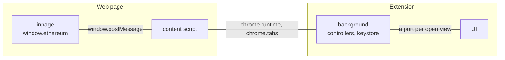

# Extension services

The extension is four separate programs that can only reach each other by passing messages. Three of them live here, along with the wiring to the fourth.

| Script                             | Runs in                                                    | Does                                                       |
| ---------------------------------- | ---------------------------------------------------------- | ---------------------------------------------------------- |
| Background (`background/`)         | a service worker on Chrome, a background page on Firefox   | owns the controllers, the keystore and all persisted state |
| Content script (`content-script/`) | every frame of every web page, isolated from the page's JS | relays messages between the page and the background        |
| Inpage (`../modules/inpage/`)      | the page's own JS world, next to the dApp's code           | the `window.ethereum` provider a dApp talks to             |
| UI                                 | extension pages: popup, side panel, tab, request window    | the React app                                              |

The background makes every decision. The other three are clients of it, which is why most of this directory is about getting messages to and from the background.

## Worlds and APIs

Two of the four run inside a web page we don't control, and they are not equally trusted.

| Script | Lives in | Browser APIs | What a hostile page can do to it |
| --- | --- | --- | --- |
| Inpage | the page's own JS world, sharing globals with the dApp | none, there is no `chrome.*` in a page | read it, patch it, replace it outright |
| Content script | an isolated JS world in the same page: own variables, same DOM | `chrome.runtime` only, so it can message the background but cannot address a tab or a frame | read the `postMessage` traffic and forge more of it, but not touch its variables |
| Background | the extension | all of them, plus the controllers, the keystore and storage | nothing, it is not reachable from a page |
| UI | extension pages | all of them | nothing |

The inpage script holds no secrets and is given no authority, because it cannot keep either. It is a `window.ethereum`-shaped postbox.

Isolated worlds stop a page from reaching into the content script's variables, but they share a `window`, and `window.postMessage` is ordinary page traffic. The dApp, an ad, an injected extension from someone else, all of them can read every message that crosses and send one that looks the same. So nothing secret goes over that hop, and nothing a message claims about its own origin counts for anything.

What does count is the sender the browser attaches to a message on the way to the background: the tab and frame it came from, the requesting frame's URL and the tab's top-level URL, all read off `meta.sender` where `providerRequestTransport` replies in `background/background.ts`. The page cannot write any of it, so that is what a dApp session is resolved from, and it is why a dApp in an iframe cannot pass itself off as the site around it.

The messaging APIs fall the same way. Nothing in a page can address anything, it can only be addressed, because reaching a page means naming its tab and that is the background's privilege alone ([why one hop needs two APIs](./messengers/README.md#why-one-hop-needs-two-apis)).

The UI port is the one channel with real power, since a port can call any controller method, key and seed export included. It is also the easiest to protect: an extension page is the only thing that can legitimately open one, so the `onConnect` listener in `background/background.ts` checks the sender's extension id and URL and disconnects anything else.

## Loading the page scripts

`background/handlers/handleScripting.ts` registers the content script and the inpage scripts at runtime, so the manifest declares none of them. Chrome, Safari and recent Firefox can inject a script straight into the page's JS world. Older Firefox cannot, so there a content script inlines the provider bundle into a `<script>` tag instead.

Page scripts run outside LavaMoat, since a page we don't own can't be locked down, and they skip Trezor's domains, where a provider only gets in the way of the hardware wallet.

## The two channels

The dApp channel is request and response, built on the messengers in [`messengers/`](./messengers/README.md). The UI channel is a long-lived port per open view: actions go up, controller state comes down. The full round trip from a `dispatch` to a re-render is described under "Controller state update lifecycle" in the root `AGENTS.md`.

## A dApp request

The provider hands the call to the content script, which passes it to the background. There a dApp session is resolved from the tab, window and frame the browser reports, and `handleProviderRequests` (in `src/common/modules/provider/`) either answers it outright or sends it through `rpcFlow`, which checks permission, unlocks the wallet and opens a request window when the user has to approve something.

Not every call gets that far. The provider answers `eth_chainId` from its own cache because dApps poll it constantly, and forwards plain read calls to the dApp's own RPC endpoint once it has found one, falling back to the wallet's provider.

## Wallet events

Every dApp connection is a `Session` in the DappsController, holding the messenger that reaches its page. Broadcasting an account change, a network change, a lock or a disconnect walks the sessions that have permission and sends to each. These are one-way, with no reply.

A broadcast lands in the whole tab, so the session's origin travels with it and the provider drops anything that doesn't match the page it is running in.

## Things not to break

- Only extension pages may open a UI port. A port can call any controller method, including key and seed export, so the background verifies the sender.
- A reply goes to the one frame that asked, not to the tab. Otherwise an answer meant for a dApp in an iframe lands in every other frame of the page.
- Where a dApp sits, meaning its frame and the tab's top-level document, always comes from the browser and never from the page.
- Page scripts do as little as possible in cross-origin and deeply nested frames, which is where ads and third-party widgets live.

## Two builds in one browser

The regular and the Next build can be installed side by side, so everything the page can see is named per build: `window.ambire` or `window.ambireNext`, and a separate set of message topics. A messenger on the wrong topic goes quiet instead of failing loudly, so this is easy to get wrong when adding a topic.

## Mobile

Mobile runs the same controllers in a WebView worker and reaches dApps over the React Native bridge, but it implements the same `Messenger` interface, so the controllers cannot tell the difference. New messaging surface added here usually needs a mobile counterpart.
