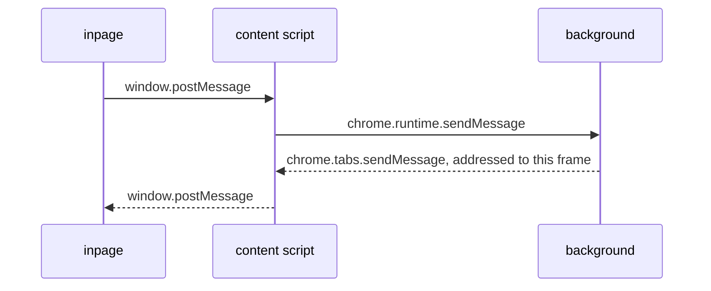

# Messengers

A messenger wraps one of the browser's messaging APIs in a promise-based `send` and `reply` pair, so a caller names the script it wants to reach instead of the API that can reach it. The interface is `Messenger` in `@ambire-common/interfaces/messenger`, and mobile implements the same one over the React Native bridge.

For what talks to what, and why, see the [extension services README](../README.md).

| Messenger         | Wraps                                        | Connects                                                  |
| ----------------- | -------------------------------------------- | --------------------------------------------------------- |
| `windowMessenger` | `window.postMessage`                         | content script and inpage, within one frame               |
| `tabMessenger`    | `chrome.runtime` and `chrome.tabs` messaging | background and content script                             |
| `bridgeMessenger` | whichever of those two the script can use    | background and inpage, which have no channel of their own |
| `PortMessenger`   | `chrome.runtime.connect` ports               | the UI and the background                                 |

`initializeMessenger({ connect })` hands back the right one for the connection you ask for, based on the script it is called from. It knows those four pairs and throws for anything else.

## Sending and replying

`send` takes a topic, a payload and an optional id, and resolves with whatever the `reply` handler on the other side returned. `reply` registers that handler for a topic and returns a function that removes it again. The handler also receives the browser's own account of the sender, which is the only trustworthy source for the tab, frame and URL a message came from.

A topic carries its direction. A message goes out as `> topic` and its answer comes back as `< topic`, matched on the id so parallel requests don't cross. The wildcard topic `*` matches anything outbound, which is what the content script's relay listens on.

Topics containing `broadcast` are one-way: `send` resolves straight away and nothing is expected back. Wallet events use those.

Errors don't survive `chrome.runtime.sendMessage`, so `tabMessenger` copies them onto a plain object and the receiving side turns them back into an `Error`.

## The bridge

The inpage script has no `chrome.*` and the background has no shared `window`, so neither can reach the other. `bridgeMessenger` resolves to the window messenger in the page and the tab messenger in the background, and `setupBridgeMessengerRelay`, which only runs in a content script, forwards between the two in both directions.

The relay also has to survive the background restarting. A fresh content script is injected into pages that are already open, which leaves the old relay running in the same page, still hearing the inpage but no longer able to reach the extension. It shuts itself down as soon as it notices that, and the new relay tells any older copy to stop rather than waiting for it to find out. The new relay then announces itself to the background, which pushes the current network and account state back down, so a page that was open the whole time gets a working provider again without a reload.

## PortMessenger

The UI needs more than request and response: the background pushes state at it constantly, and has to know when a view goes away. Ports do both, so every view opens one named after what kind of view it is, and the background keeps them all. Messages are tagged by direction, `> background` for actions and `> ui` and its variants for state, errors and toasts, and go through `richJson` so a `BigInt` or a `Map` survives the trip.

Ports fail usefully too. Posting to a dead one throws immediately, which is how a view learns the background is gone without waiting for the disconnect event.

## Why one hop needs two APIs

`chrome.runtime.sendMessage` gets a content script's message to the background but not the reverse: sent from the background it reaches the extension's own pages, not the content scripts in a web page. Those have to be addressed by tab, with `chrome.tabs.sendMessage`. `tabMessenger` covers both and picks by whether it was given a tab id. Replies name the requesting frame as well, so an answer only reaches the document that asked, while broadcasts name no frame and reach the tab.
